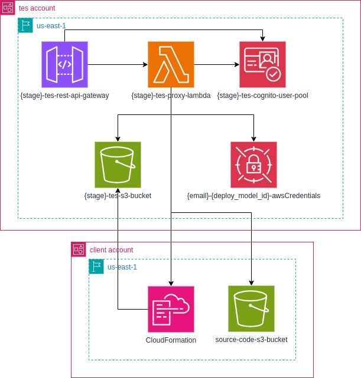

# TES - Test Environment Sector
# Backend
## Descrição

O TES é uma plataforma utilizada para criação de ambientes de desenvolvimento na nuvem.

## Documentação
Este é o diagrama AWS da aplicação e inclui os recursos utilizados para o seu desenvolvimento:



Toda a diagramação foi feita utilizando a ferramenta `Draw.io` e estão disponíveis no arquivo `docs/tes-backend.drawio`.

## Requisitos
Estes são os requisitos da aplicação:
- [Serverless Framework versão 3](https://www.serverless.com/framework/docs)
- [Node versão 18](https://nodejs.org/en)
- [NPM versão 9](https://nodejs.org/en)
- [AWS CLI versão 2](https://aws.amazon.com/cli/)
- Linux

## Implantação
- Autentique a sua AWS CLI.

- Execute o comando abaixo para implantar a aplicação. Utilize o stage como `dev` ou `prod`:
```bash
export STAGE="dev"

rm -r node_modules dist && \
npm install && \
npm run build && \
sls deploy --stage $STAGE
```

- Envie os templates CloudFormation para o bucket:
```bash
aws s3 cp templates/ContainerModel.yaml s3://$STAGE-tes-s3-bucket/ContainerModel.yaml
```

Para realizar a remoção execute o seguinte comando:
```bash
sls remove --stage dev
```
